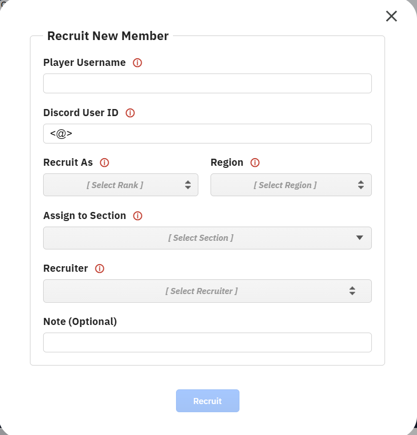
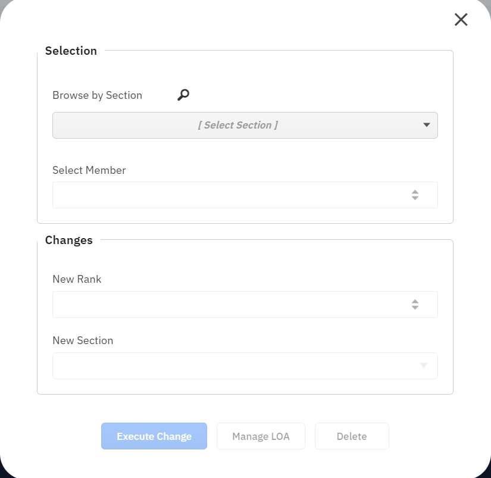
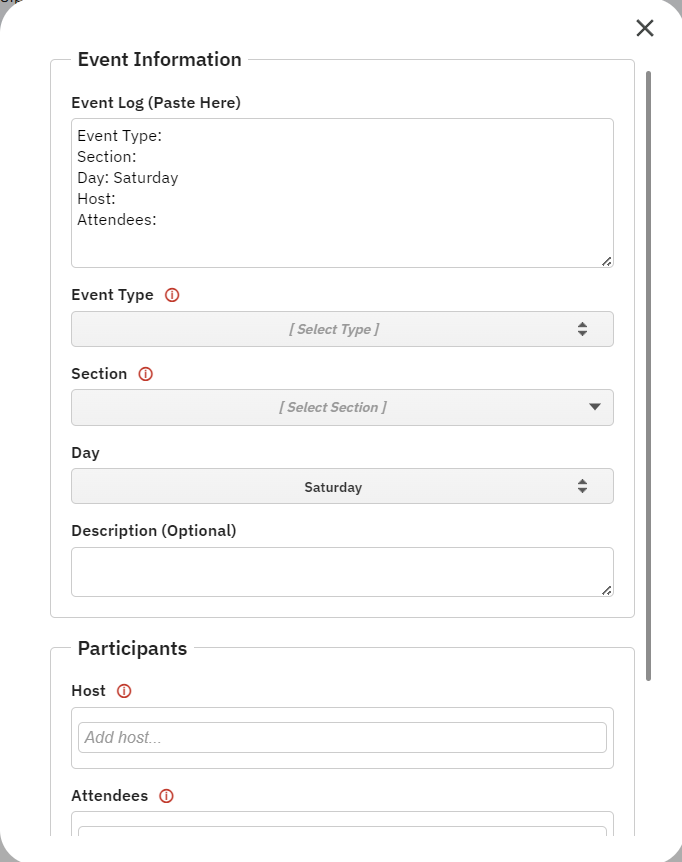

# THEMIS - Google Sheets Administration Utility

[](https://github.com/wpenistone/THEMIS-DB-Sheets)
[](LICENSE)
[](https://developers.google.com/apps-script)

> **THEMIS** (ΤΗΕΜΙΣ) - A comprehensive Google Sheets-based administration utility designed for managing organizational hierarchies, member recruitment, event logging, and attendance tracking in gaming communities and military simulation groups. Featuring a perfected user experience with intuitive, polished interfaces that make complex administrative tasks feel effortless.


## Screenshots

### Recruit Dialog


### Management Menu


### Event Dialog


## Overview

THEMIS is a sophisticated management system built on Google Apps Script that transforms Google Sheets into a powerful organizational management platform. Originally designed for military themed gaming communities, it provides comprehensive tools for:

- **Member Management**: Track personnel, ranks, assignments, and contact information
- **Recruitment System**: Streamlined process for adding new members with validation
- **Event Logging**: Comprehensive event tracking with attendance management
- **Leave Management**: LOA (Leave of Absence) tracking and automated expiration
- **Discord Integration**: Real-time notifications via Discord webhooks
- **Hierarchical Organization**: Support for complex organizational structures

## As a Project

### "Isn't this overkill for a Google Sheet?"

THEMIS is absolutely overkill (with around 10,000 lines of code [THEMIS v1.5 had 1,000.]), this started as a hobby project for me, but I'd like to also help others save time.

### Deployment History
- THEMIS v2.5x - Current (Pilot Program): IMPERIUM | Rome (290+ members)
- THEMIS v1.0 - Previous: NORTHWIND | SLC | 2nd Company (180+ members)
- Predecessor System: NORTHWIND | SLC | Royal Rangers (90+ members)
- - This system was built for only event logging and attendance automation.


##  Features

### Core Functionality
- **Dynamic Member Database**: Real-time synchronization with Google Sheets
- **Rank & Role Management**: Hierarchical rank system with promotion/demotion tracking
- **Recruitment Pipeline**: Automated recruitment process with validation rules
- **Event Management**: Event logging with attendance tracking and host validation
- **LOA System**: Leave of Absence management with automatic expiration handling
- **Attendance Validation**: Automated checking of attendance records against member database
- **Discord Integration**: Webhook notifications for all major events
- **Advanced Caching**: Multi-level caching system for optimal performance
- **Data Validation**: Comprehensive validation rules for data integrity

### Advanced Features
- **Hierarchical Organization**: Support for complex organizational structures (Companies → Platoons → Squads)
- **Location Management**: Track member assignments across multiple sheets/locations
- **Custom Fields**: Extensible system for additional member data (Phase tracking, etc.)
- **Analytics & Reporting**: Built-in reporting and data analysis capabilities
- **Real-time Updates**: Live synchronization across multiple users
- **Permission Management**: Role-based access control and sheet permissions
- **Perfected UX/UI**: Polished, intuitive interfaces crafted for seamless user experience and operational efficiency
- **Extensive Configuration**: Highly customizable configuration system

##  Quick Start

### Prerequisites
- Google account set as primary
- Google Sheets
- Basic understanding of Google Apps Script (for setup)

### Data Integrity Warning
To ensure system-wide data integrity, modifications to personnel placement, position, or slot assignments must be executed exclusively through the THEMIS system interface. Direct manual editing of these organizational fields bypasses system logic, leading to data desynchronization.

Other data fields (e.g. phase values) can be edited manually and will carry over correctly.

If a manual edit to organizational fields is necessary, purge the script cache immediately via THEMIS > About > Clear Script Cache.

### First-Time Setup & Permissions

#### Granting Authorization
The first time any user executes a function from the "THEMIS" menu, Google's security framework will require authorization. This is a one-time process per account.

1. Select any function from the THEMIS menu (e.g., THEMIS > Manage)
2. Click "Continue" on the "Authorization Required" dialog
3. Select the Google account that has edit access to this sheet
4. On the warning screen, click "Advanced", then "Go to THEMIS (unsafe)"
5. Review the permissions and click "Allow". The script is now authorized

#### Understanding the "View and manage your spreadsheets" Permission
During authorization, Google will ask for permission to "View and manage your spreadsheets in Google Drive." This message can be alarming, but it is the standard, broadest permission required for any script that interacts with Google Sheets.

**Important Notes:**
- THEMIS will ONLY edit the current sheet
- This permission is about the script's potential power, not its actual behavior
- THEMIS is hard-coded to only operate on the single spreadsheet it is bound to
- It does not have the ability to see, access, or modify any of your other files in Google Drive
- This permission is simply required by Google to allow the script to function within this one sheet

#### Issues with Multiple Google Accounts
See the [Primary Google Account Requirement](#primary-google-account-requirement) in the Limitations section.

**Solutions:**
- **Set your primary account as the default**: Log out of all Google accounts. Then, log back into the account you use to edit the sheet first. This will set it as the default account for the browser session
- **Use an Incognito or Private window**: This is the simplest solution. Open an Incognito/Private window and log in only to the required Google account
- **Use a dedicated browser profile**: Create a separate browser profile for your work with THEMIS and log in with only the required Google account

#### Resetting Denied Permissions
If you accidentally deny the authorization request, Google will not ask you again. To fix this, you must manually revoke the script's access from your Google Account settings. This will force the authorization prompt to reappear the next time you use THEMIS.

1. Go to your Google Account's security page by visiting: [myaccount.google.com/permissions](https://myaccount.google.com/permissions)
2. Find an entry in the list named "THEMIS" under "Third-party apps with account access"
3. Click on the "THEMIS" entry to expand its details
4. Click the button that says "Remove Access" and confirm your choice
5. Return to the Google Sheet and run any THEMIS function. You will now be presented with the authorization prompt again. Follow the steps in the Granting Authorization section above to grant access

**Note**: For issues with multiple Google accounts, see the [Primary Google Account Requirement](#primary-google-account-requirement) in the Limitations section below.

### Installation

1. **Create a new Google Sheet** for your organization
2. **Open Apps Script Editor**: `Extensions > Apps Script`
3. **Copy the THEMIS code** from [`src`](src) into the script editor
4. **Configure your organization** by copying and modifying one of the example configurations:
   - [`Example_configs/IMPERIUM_Rome_Config.js`](Example_configs/IMPERIUM_Rome_Config.js) - Roman Empire themed configuration
   - [`Example_configs/NORTHWIND_2C_Config.js`](Example_configs/NORTHWIND_2C_Config.js) - British military themed configuration
5. **Set up your sheets** according to the configuration structure
6. **Configure Discord Webhooks** (optional but recommended)
7. **Test the installation** by refreshing the sheet and checking for the THEMIS menu

### Initial Setup

1. **Create Required Sheets**: Based on your configuration file, create the necessary sheets (e.g., "Legio VI", "Event Logbook", "Attendance Logbook")
2. **Set Up Sheet Structure**: Configure columns and layouts according to your chosen configuration
3. **Configure Daily LOA Processing**: Set up a daily trigger to automatically process expired LOA (Leave of Absence) entries
4. **Test Core Functions**: Use the THEMIS menu to test basic functionality
5. **Configure Discord Integration**: Add webhook URLs for notifications

**Note**: If your organization is large, you may DM me on Discord (@wpenistone) for help with setup.

##  Project Structure

```
├── src/
│   ├── Code.js                    # Main THEMIS script
│   ├── AboutDialog.html          # About dialog interface
│   ├── ManagementDialog.html     # Member management interface
│   ├── RecruitDialog.html        # Recruitment interface
│   ├── EventDialog.html          # Event logging interface
│   └── ValidationResults.html    # Attendance validation results
├── Example_configs/
│   ├── IMPERIUM_Rome_Config.js   # Roman Empire themed configuration
│   └── NORTHWIND_2C_Config.js    # British military themed configuration
├── images/
│   ├── logo.png                  # THEMIS logo
│   ├── recruit-dialog.png        # Recruitment interface screenshot
│   ├── management-menu.png       # Member management interface screenshot
│   └── event-dialog.png          # Event logging interface screenshot
├── tools/                        # Development and utility tools
├── LICENSE                       # Custom license terms
├── .gitignore                   # Git ignore rules
├── v                            # Version file for system checks
└── README.md                    # This file
```

## Configuration

THEMIS uses a comprehensive configuration system defined in JavaScript configuration files. Key configuration areas include:

### Organization Hierarchy
```javascript
"ORGANIZATION_HIERARCHY": [{
  "name": "Legio VI",
  "sheetName": "Legio VI",
  "children": [{
    "name": "First Cohort",
    "sheetName": "VI 1C",
    "children": [{
      "name": "First Aquilia Contubernium",
      "shortcuts": ["VI 1A"],
      "useSlotsFrom": "STANDARD_CONTUBERNIUM"
    }]
  }]
}]
```

### Rank System
```javascript
"RANK_HIERARCHY": [
  { "abbr": "AUX", "name": "Auxilia" },
  { "abbr": "TIR", "name": "Tirones" },
  { "abbr": "MIL", "name": "Milites" },
  // ... more ranks
  { "abbr": "CON", "name": "Consul" }
]
```

### Layout Blueprints
```javascript
"LAYOUT_BLUEPRINTS": {
  "BILLET_OFFSETS": {
    "offsets": {
      "username": { "row": 0, "col": 0 },
      "rank": { "row": 0, "col": 1 },
      "discordId": { "row": 1, "col": 1 },
      "region": { "row": 1, "col": 0 },
      "joinDate": { "row": 1, "col": 2 },
      "LOAcheckbox": { "row": 1, "col": 3 }
    }
  }
}
```

##  Usage

### Basic Operations

#### Member Management
- **Add Members**: Use the "Recruit" dialog to add new members
- **Update Information**: Modify member details through the management interface
- **Track Promotions**: Automatic rank change logging and notifications
- **Manage LOA**: Set leave status with automatic expiration

#### Event Management
- **Log Events**: Record training sessions, operations, and other activities
- **Track Attendance**: Link events to attendance records
- **Host Validation**: Ensure only qualified members can host events

#### Administrative Tasks
- **Validate Attendance**: Check attendance records against member database
- **Clear Cache**: Maintain system performance
- **View System Status**: Monitor version and update status

### Menu Structure
```
THEMIS
├── Manage          - Member management interface
├── Recruit         - Add new members
├── Log Event       - Record events and attendance
├── Validate Attendance - Check attendance validity
└── About           - System information and cache management
```

##  Advanced Configuration

### Custom Fields
Extend member data with custom fields:
```javascript
"CUSTOM_FIELDS": [{
  "key": "phase",
  "label": "Phase",
  "offsetKey": "phase",
  "defaultValue": 1,
  "type": "integer",
  "validation": {
    "min": 1,
    "max": 3
  }
}]
```

### Event Types
Define custom event types:
```javascript
"EVENT_TYPE_DEFINITIONS": [{
  "name": "Combat Training",
  "aliases": ["CT", "Combat Practice"]
}, {
  "name": "Crate Run",
  "aliases": ["Crates", "Supply Run"]
}]
```

### Validation Rules
Set up data validation:
```javascript
"VALIDATION_RULES": {
  "USERNAME": {
    "REGEX": "^[a-zA-Z0-9_]+$",
    "MIN_LENGTH": 3,
    "MAX_LENGTH": 20
  }
}
```

##  Discord Integration

Configure Discord webhooks for real-time notifications:

```javascript
"WEBHOOK_URL": "https://discord.com/api/webhooks/YOUR_WEBHOOK_ID/YOUR_WEBHOOK_TOKEN",
"LOA_MENTION_ROLE_ID": "your_role_id"
```

### Notification Types
- **Member Updates**: Promotions, demotions, assignments
- **Recruitment**: New member additions
- **LOA Changes**: Leave status updates and expirations
- **Event Logging**: Event creation and attendance
- **System Alerts**: Errors and important notifications

##  Development

### Code Organization
- **Core Functions**: Member operations, data management, caching
- **UI Components**: HTML dialogs for user interaction
- **Configuration System**: Hierarchical organization setup
- **Integration Layer**: Discord webhook management
- **Utility Functions**: Date handling, validation, formatting

### Key Functions
- `Hebe_Initiat()` - Member recruitment
- `Dike_Iudicat()` - Member updates and promotions
- `Atropos_Secat()` - Member removal
- `Janus_Registrat()` - Event logging
- `Morpheus_Inducit()` - LOA management
- `Horae_Expirant()` - LOA expiration processing

### Caching Strategy
- **Memory Cache**: Runtime data storage
- **Script Cache**: Persistent cache with expiration
- **Sheet Cache**: Individual sheet data caching
- **Configuration Cache**: Organization structure caching

##  System Architecture

### Data Flow
1. **Configuration Loading**: Organization structure and rules
2. **Sheet Reading**: Data extraction from Google Sheets
3. **Cache Population**: Multi-level caching for performance
4. **User Operations**: Recruitment, updates, event logging
5. **Discord Notifications**: Real-time webhook notifications
6. **Cache Invalidation**: Maintain data consistency

### Performance Optimizations
- **Batch Operations**: Minimize Google Sheets API calls
- **Advanced API Usage**: Doesn't seem to improve performance.
- **Intelligent Caching**: Multi-tier caching strategy
- **Background Processing**: Asynchronous webhook delivery

##  Troubleshooting

### Common Issues

#### "Required sheets missing" Error
- Ensure all sheets defined in configuration exist
- Check sheet names match exactly (case-sensitive)
- Verify sheet structure matches configuration

#### Discord Webhook Failures
- Verify webhook URL is correct and active
- Check Discord permissions for the webhook
- Monitor webhook rate limits

#### Performance Issues
- Clear script cache using the About dialog
- Merge multiple sheets together / reduce amount of sheets
- Verify configuration is properly structured

#### Permission Errors
- The most likely cause is issues with multiple Google accounts, see the [Primary Google Account Requirement](#primary-google-account-requirement) in the Limitations section.
- Ensure user has edit access to the spreadsheet
- Check Google Apps Script permissions
- Verify external request permissions for Discord integration

### Debug Mode
Enable detailed logging by checking the Google Apps Script execution logs in the script editor.

## Limitations

### Speed
Actions that change the spreadsheet take about 4-5 seconds to complete (benchmarked in the 290+ member 'IMPERIUM | Rome' sheet).

Why? About 98% of this delay is waiting for Google's servers to process the data. It's a fundamental limitation of the platform.

### Required Telemetry (for development, not implemented yet)
To keep improving THEMIS, the script must be able to send anonymized health and performance data to a development server.

What is sent: Function run times, error reports without personal data, and which features are being used.

What is NEVER sent: Your private data. No member names, Discord IDs, emails, or any other personally identifiable information ever leaves your spreadsheet. This data is essential for me to find bugs and make the system better for everyone.

### Primary Google Account Requirement
When you are logged into multiple Google accounts in the same browser (e.g., a personal and a work account), Google's services can default to the wrong account and cause permission errors.

Solution: For THEMIS to work reliably, the Google account with access to the spreadsheet must be the primary account in your browser session. The primary account is the one you signed into first. The simplest way to manage this is to use a dedicated Chrome Profile for your organization, which keeps all sessions separate.

##  Contributing

1. Fork the repository
2. Create a feature branch
3. Make your changes
4. Test thoroughly with your configuration
5. Submit a pull request

### Development Guidelines
- Maintain backward compatibility
- Add comprehensive error handling
- Include configuration examples
- Update documentation for new features
- Test with multiple organization sizes

##  Roadmap

###  The THEMIS Configuration Studio (Visual Editor)

A planned visual configuration tool that will make THEMIS setup intuitive and error-free:

####  Visual Layout Designer
- **Drag-and-Drop Interface**: Place fields like 'username', 'rank', and 'joinDate' exactly where you want them on your spreadsheet
- **Real-Time Preview**: See how your spreadsheet layout will look as you design it
- **Template Library**: Pre-built layouts for common organizational structures

####  Organization Tree Editor
- **Visual Chain of Command**: Map out your entire hierarchy from HQ down to individual teams
- **Interactive Tree View**: Click, drag, and reorganize your organizational structure visually
- **Auto-Validation**: Ensures logical hierarchy and prevents circular references

####  Live Error Checking
- **Instant Feedback**: Get warned immediately if you reference a non-existent rank or misconfigure a field
- **Smart Suggestions**: The editor suggests corrections for common mistakes
- **Configuration Testing**: Test your setup before deploying to prevent broken configurations

##  License

This project is licensed under a custom license that requires:
- **Public Repository**: Any copies, forks, or clones must be made publicly available
- **Creator Credit**: The original creator ([wpenistone](https://github.com/wpenistone)) must be credited and informed of derivative works
- **No Private Use**: The code cannot be used in private repositories or commercial products without permission
- **Custom Configurations Allowed**: You may create and use custom configurations for your own organization

See the [LICENSE](LICENSE) file for full details.

##  Acknowledgments

- **Author**: [wpenistone](https://github.com/wpenistone)
- **AI that Assisted with Coding**: Gemini 2.5 Pro (Nearly all 💙), Grok Code Fast
- **Google Apps Script**: Platform for script execution
- **Discord Webhooks**: Integration for notifications

##  Support

For support and questions:
- Check the [Issues](../../issues) page for known problems
- Review the troubleshooting section above
- Ask on Discord: @wpenistone
- Ensure you're using the latest version

---
